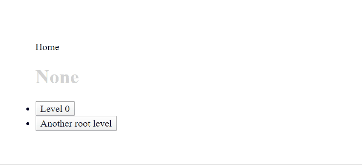

# WorkFlowy Style List React

A React component for displaying infinitely nestable lists and tree structures in a manageable way similar to the productivity app [WorkFlowy](https://workflowy.com/).

## Features
* Display one level at a time
* Allow infinite drill-down or nesting
* Display where you are in the tree as a bread-crumbs style navigation

## How to Run
1. Install dependencies

   npm install

2. Run the http server

   npx http-server -c-1

3. Navigate to http://127.0.0.1:8080/

## Usage
See `index.js`.
